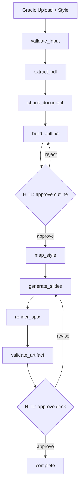

# PDF2Deck Agent

A production-oriented MVP that converts a PDF chapter into a structured, styled PowerPoint deck.

## Architecture



The LLM is responsible for semantic transformation; deterministic Python code owns PDF extraction, validation, style mapping, and PowerPoint rendering.

## Quick start

```bash
python -m venv .venv
source .venv/bin/activate
pip install -e ".[dev]"
cp .env.example .env
# add OPENAI_API_KEY
python -m pdf2deck.app
```

Open the Gradio URL printed by the app.

## Template usage

Upload a `.pptx` template/presentation in the UI. `python-pptx` treats an existing presentation as the starting point for the generated deck; the renderer clones the selected base deck and removes its content slides before adding generated slides. See the official documentation for the template model.

## Production direction

- Replace `MemorySaver` with PostgreSQL-backed LangGraph persistence.
- Put generated artifacts in object storage (S3-compatible).
- Run the graph behind a queue/worker service.
- Keep Gradio as an internal/operator UI; expose an API for production clients.
- Add a render-validation service using LibreOffice/headless PowerPoint-compatible rendering for visual regression.
- Use Langfuse datasets/evaluations for content-preservation regression tests.
