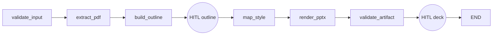

# Implementation Guidelines

## 1. Design principles

1. **Typed boundaries**: every graph input/output and LLM payload is a Pydantic v2 model.
2. **Deterministic rendering**: LLM output becomes a validated `DeckOutline`; the renderer never asks an LLM what to draw.
3. **Traceability**: every slide carries `source_chunk_ids`.
4. **Resumability**: HITL pauses use LangGraph interrupts and a thread/checkpoint ID.
5. **Prompt isolation**: prompts are versioned skills, not inline node strings.
6. **Failure isolation**: observability failures must never block artifact creation.

## 2. Codebase layout

```text
src/pdf2deck/
  app.py                 # Gradio adapter only
  graph.py               # graph topology and node orchestration
  schemas.py             # Pydantic contracts
  config.py              # settings
  observability.py       # Langfuse boundary
  prompts.py             # prompt text
  skills.py              # versioned prompt metadata
  services/
    pdf_service.py       # deterministic PDF extraction/chunking
    llm_service.py       # model invocation + structured output
    pptx_service.py      # deterministic artifact rendering
tests/
docs/
```

## 3. State model

The graph state is a Pydantic `DeckState`.

```text
run_id
pdf_path
style
document?
outline?
styled_slides[]
artifact?
events[]
error?
approved_outline
approved_deck
```

The state intentionally does not contain raw model messages. This keeps checkpoints compact and makes state inspectable.

### State ownership

| Field | Producer | Consumers |
|---|---|---|
| document | extract_pdf | build_outline |
| outline | build_outline | HITL, map_style, render |
| styled_slides | map_style | render |
| artifact | render | validation, HITL, UI |
| approvals | HITL | routing/terminal state |

## 4. Graph topology



Do not introduce a free-form agent loop into the deterministic pipeline. Agentic delegation is appropriate inside a bounded reasoning stage if later requirements justify it.

## 5. LLM contract

Use `with_structured_output(DeckOutline)`.

The model must not emit:
- raw PowerPoint XML,
- arbitrary Python,
- unsupported source claims,
- slides without source IDs.

The application validates all output before it can reach the renderer.

## 6. PDF parsing

The MVP uses text extraction with `pypdf`.

For scanned PDFs, add an OCR adapter behind the same `PdfService` boundary:

```python
class DocumentExtractor(Protocol):
    def extract(self, path: Path) -> SourceDocument: ...
```

A production implementation can route pages through OCR only when extracted text density is below a threshold.

## 7. Semantic chunking

The MVP uses page/paragraph-aware chunking to keep source IDs stable.

Production upgrades:
- section/header detection,
- token-based boundaries,
- overlap only when required,
- preservation of tables/figures,
- OCR confidence metadata.

Do not make chunk IDs dependent on LLM output.

## 8. Style mapping

The LLM proposes content structure only. `map_style` maps semantic slide types to deterministic layouts.

Example mapping:

```text
title      -> title layout
bullets    -> title + content
process    -> process layout
comparison -> comparison layout
concept    -> concept layout
summary    -> summary layout
```

A production template registry should map stable semantic layout names to actual PowerPoint layout IDs.

## 9. Renderer boundary

`PptxService` owns all `python-pptx` details.

The graph never imports `pptx`.

This permits replacing the renderer with:
- a server-side Office renderer,
- PptxGenJS,
- SVG/image-based slide generation,
- a corporate template service.

## 10. Error handling

Every node should fail with an explicit domain error.

Recommended hierarchy:

```text
Pdf2DeckError
  InputValidationError
  DocumentExtractionError
  OutlineGenerationError
  StyleMappingError
  RenderingError
  ArtifactValidationError
```

The MVP uses exceptions directly. Production should add middleware that:
- catches domain exceptions,
- records a failed node event,
- emits a Langfuse observation,
- applies bounded retries to transient LLM/network errors,
- never retries deterministic validation failures.

## 11. Retry policy

Retry only:
- provider 429/5xx,
- network timeouts,
- transient model gateway failures.

Do not retry:
- invalid Pydantic output after a deterministic repair limit,
- invalid PDF,
- template corruption,
- unsupported slide layout.

Use exponential backoff with jitter and a small maximum attempt count.

## 12. HITL

There are two checkpoints:

### Outline checkpoint
Human verifies:
- coverage of chapter structure,
- slide count,
- ordering,
- claims and traceability.

### Artifact checkpoint
Human verifies:
- visual hierarchy,
- template/style fidelity,
- clipping/overflow,
- readability.

A rejection should transition to a revision path in the production version rather than terminating the run. The MVP exposes the checkpoint mechanism and keeps the revision path intentionally bounded.

## 13. MCP vs standard tools

Use standard Python services for local deterministic capabilities:
- PDF extraction,
- PPTX rendering,
- filesystem/object storage.

Use MCP when the capability is an external, independently governed tool/service that benefits from a standardized tool contract, e.g.:
- enterprise document repositories,
- design asset libraries,
- external metadata systems.

Do not introduce MCP merely because the application is agentic.

## 14. Type-safety rules

- `mypy --strict`
- no untyped dictionaries at domain boundaries
- Pydantic models for LLM and graph contracts
- explicit return types for all public functions
- `Protocol` for replaceable services
- `Literal`/enums for finite workflow states
- no `Any` unless isolated at a third-party integration boundary

## 15. Testing strategy

### Unit
- PDF extraction
- chunking
- style mapping
- schema rejection
- renderer layout selection

### Contract
- structured LLM output parses into `DeckOutline`
- every slide has valid source IDs

### Integration
- full graph with mocked LLM
- checkpoint/resume
- artifact existence and openability

### Evaluation
Maintain a dataset of source chapters and expected structural concepts. Track:
- source coverage,
- unsupported-claim rate,
- outline edit distance,
- slide density,
- render validity,
- human acceptance rate.

Langfuse datasets/evaluations should become the regression harness for prompt/model changes.
