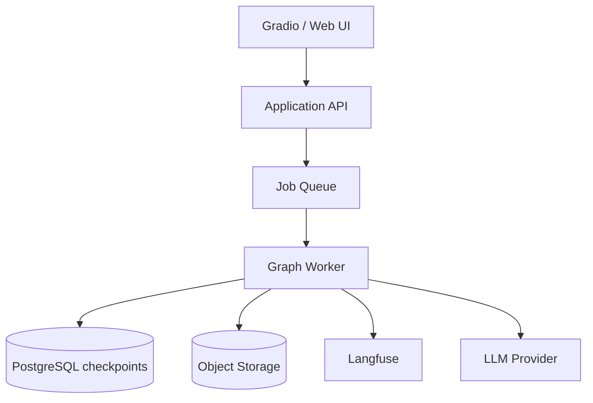

# Operations Guidelines

## 1. Runtime configuration

All configuration comes from environment variables or deployment secrets.

Required in production:
- `OPENAI_API_KEY`
- `LANGFUSE_PUBLIC_KEY`
- `LANGFUSE_SECRET_KEY`
- `LANGFUSE_BASE_URL`

Never store secrets in Git.

## 2. Langfuse observability

The application should capture:
- run ID / session ID
- node name
- model name
- latency
- token usage and cost where available
- retries
- structured output failures
- source/chunk counts
- slide count
- artifact generation duration
- HITL decision

Langfuse's current Python SDK uses an OpenTelemetry-based API and supports `get_client()` / `start_as_current_observation`; its LangChain integration provides `CallbackHandler`. Keep the observability layer behind `observability.py` so SDK changes do not spread through the domain code.

## 3. Privacy

PDFs may contain copyrighted or confidential material.

Controls:
- avoid logging full PDF text,
- avoid logging complete model prompts in production unless policy permits,
- hash or redact document identifiers,
- configure retention,
- restrict artifact access,
- use private/self-hosted observability where required.

## 4. Local setup

```bash
python -m venv .venv
source .venv/bin/activate
pip install -e ".[dev]"
cp .env.example .env
python -m pdf2deck.app
```

Windows PowerShell:

```powershell
py -3.11 -m venv .venv
.venv\Scripts\Activate.ps1
pip install -e ".[dev]"
copy .env.example .env
python -m pdf2deck.app
```

## 5. Health checks

Production API deployment should expose:
- `/health/live`
- `/health/ready`

Readiness should verify:
- model provider configuration,
- checkpoint backend connectivity,
- object storage connectivity.

Do not make Langfuse availability a hard readiness dependency.

## 6. Persistence

### MVP
`InMemorySaver` is acceptable for local development.

### Production
Use a durable LangGraph checkpoint backend such as PostgreSQL-backed persistence. Thread IDs must be stable and unguessable.

Persist:
- workflow state,
- HITL checkpoints,
- execution metadata.

Store PDFs/PPTX files in object storage, not inside graph checkpoints.

## 7. Deployment topology

Recommended:



For a small internal deployment, Gradio can call the graph directly. For enterprise workloads, separate UI/API from workers.

## 8. Scalability

The expensive stages are:
- LLM outline generation,
- artifact rendering.

Scale workers horizontally.

Use:
- bounded concurrency,
- per-provider rate limits,
- idempotency keys,
- artifact deduplication,
- queue backpressure,
- maximum PDF pages/chars,
- maximum slide count.

## 9. Failure recovery

A run should be restartable from the last durable checkpoint.

Examples:
- model timeout after extraction -> resume from outline stage,
- renderer crash -> rerun renderer,
- worker restart during HITL -> resume using thread ID.

Never recompute the PDF extraction just because the UI reconnects.

## 10. Security

- validate extension and MIME/content signature,
- enforce size/page limits,
- scan uploaded files in enterprise deployments,
- write to isolated temporary directories,
- prevent path traversal,
- use random artifact names,
- expire download links.

## 11. Cost controls

Track per run:
- input/output tokens,
- model calls,
- retry count,
- render time.

Apply:
- maximum chunks included in a single prompt,
- maximum slide count,
- cheaper model for extraction/repair,
- stronger model only for outline reasoning.

## 12. Deployment checklist

- [ ] secrets configured
- [ ] durable checkpoint store configured
- [ ] object storage configured
- [ ] Langfuse tracing verified
- [ ] PDF security scanning enabled
- [ ] worker concurrency bounded
- [ ] model timeout configured
- [ ] retry policy configured
- [ ] artifact cleanup policy configured
- [ ] evaluation dataset passing
- [ ] visual regression sample passing
